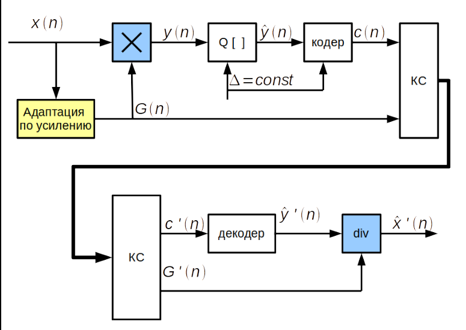
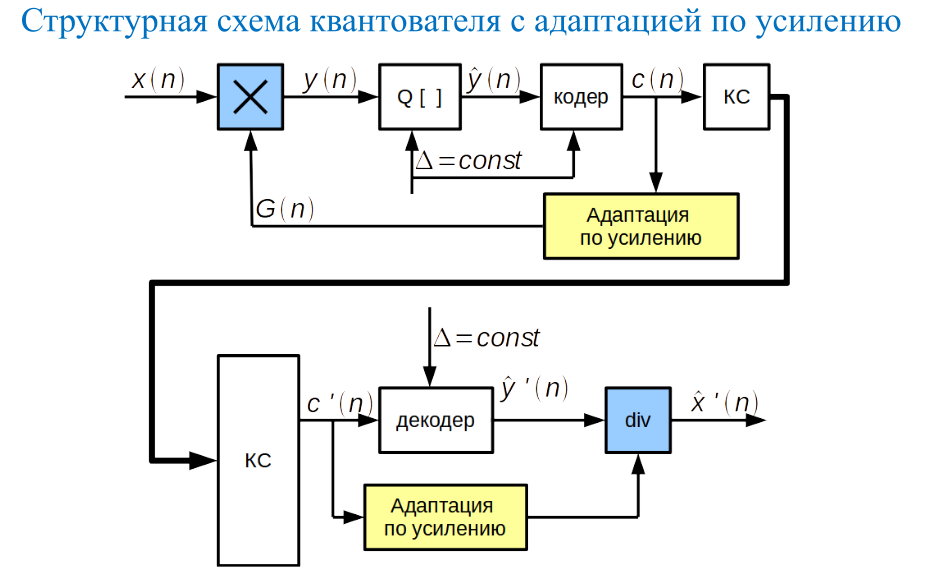
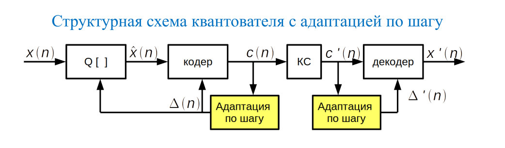
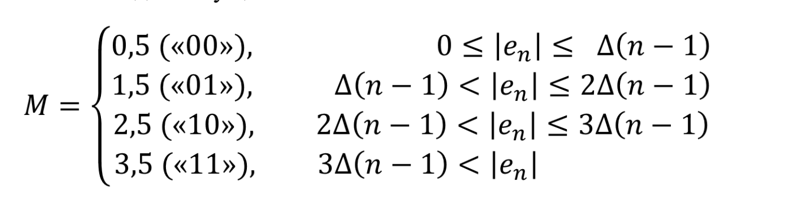
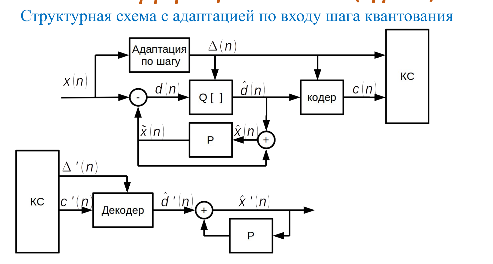
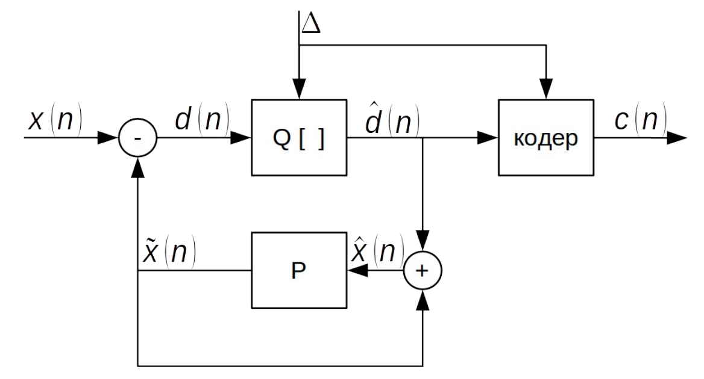
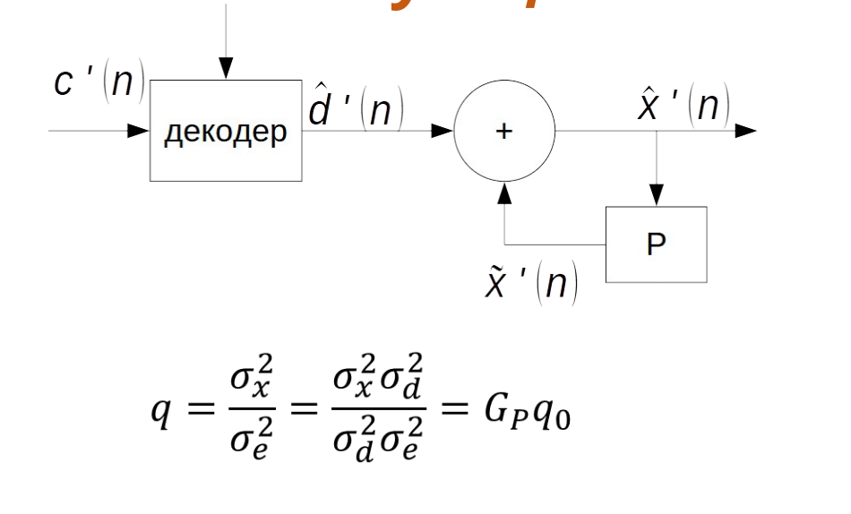

# Подготовка к экзамену: Сжатие с потерями (МФТИ, Бузыканов)

> Источники: лекции 01–05, 07–08. Лекция 06 повреждена — JPEG/JPEG2000 восстановлены по PPTX.

---

## Вопрос 1. Выбор частоты дискретизации, ошибки усечения и наложения

### Теорема Котельникова (Найквиста–Шеннона)

Для точного восстановления аналогового сигнала с максимальной частотой $f_{\max}$ необходимо и достаточно:

$$f_д \geq 2 f_{\max}$$

Частота $f_{\text{Найквист}} = 2 f_{\max}$. При меньшей частоте точное восстановление невозможно.

### Ошибка усечения (truncation error)

Возникает из-за того, что реальный сигнал имеет бесконечную длительность, а анализируется конечный отрезок. Обрезание во временной области ≡ свёртка спектра с sinc-функцией → **эффект Гиббса** и межспектральное просачивание (spectral leakage).

### Ошибка наложения (aliasing)

Если спектр не ограничен сверху $f_д/2$, высокочастотные составляющие $f > f_д/2$ «накладываются» на низкочастотную область и неотличимы от исходных. Дискретизация с шагом $T = 1/f_д$ даёт периодическое повторение спектра с периодом $f_д$; при перекрытии копий — алиасинг.

**Условие отсутствия алиасинга:** $f_{\max} \leq f_д / 2$.

### Практические значения $f_д$

| Применение | $f_д$ |
|---|---|
| Телефонная речь | 8 кГц |
| Широкополосная речь (HD Voice) | 16 кГц |
| Аудио CD | 44,1 кГц |
| Студийное аудио | 48–96 кГц |

---

## Вопрос 2. Методы уменьшения ошибок восстановления ограниченных во времени сигналов

### Причина

Идеальный ФНЧ (sinc) имеет бесконечную импульсную характеристику — неприменим на практике. Обрезание сигнала вызывает краевые эффекты.

### Методы

**1. Оконные функции (windowing)**

Перед ДПФ сигнал умножается на $w(n)$, плавно убывающую к нулю:
- Прямоугольное: максимальное разрешение, большие боковые лепестки.
- Хэннинга: $w(n) = 0{,}5\,(1 - \cos(2\pi n/N))$ — хорошее подавление лепестков.
- Хэмминга, Блэкмана, Кайзера — различные компромиссы.

**2. Антиалиасинговый фильтр (AAF)**

Перед дискретизацией — аналоговый ФНЧ с частотой среза $\leq f_д/2$.

**3. Передискретизация (oversampling)**

$f_д \gg 2 f_{\max}$ снижает требования к крутизне аналогового AAF. Применяется в сигма-дельта АЦП.

**4. Интерполяция при восстановлении**

Вместо идеального sinc: линейная интерполяция, сплайны, КИХ-фильтры.

**5. Перекрытие кадров (overlap-add)**

В MDCT соседние кадры перекрываются на 50% → устранение краевых артефактов (TDAC — Time Domain Aliasing Cancellation). Используется в MP3, AAC, AC-3.

---

## Вопрос 3. Квантование РС. Равномерное квантование. Квантователь с усечением, с округлением

### Квантование

Замена непрерывного по амплитуде сигнала $x(n)$ ближайшим значением из конечного набора $\{y_k\}$:

$$\hat{x}(n) = Q[x(n)]$$

При $B$ битах число уровней $M = 2^B$.

### Равномерное квантование

Диапазон $[-X_{\max}, +X_{\max}]$ делится на $M = 2^B$ равных интервалов:

$$\Delta = \frac{2 X_{\max}}{2^B}$$

### Квантователь с усечением (floor)

$$\hat{x}(n) = \Delta \cdot \lfloor x(n)/\Delta \rfloor$$

Ошибка: $e(n) \in [0, \Delta)$ — всегда неотрицательна → систематическое смещение. Дисперсия: $\sigma_e^2 = \Delta^2/3$.

### Квантователь с округлением (round)

$$\hat{x}(n) = \Delta \cdot \text{round}(x(n)/\Delta)$$

Ошибка: $e(n) \in [-\Delta/2, +\Delta/2)$ — симметрична, нет смещения. Дисперсия: $\sigma_e^2 = \Delta^2/12$ (в 4 раза лучше).

### Перегрузка

При $|x(n)| > X_{\max}$ — **clipping** — ошибка резко возрастает. $X_{\max}$ выбирается с запасом под пиковые значения.

---

## Вопрос 4. Ошибки при равномерном квантовании, выбор количества уровней квантования

### Модель шума квантования

При $2^B \gg 1$ ошибка моделируется как белый шум на $[-\Delta/2, \Delta/2]$:
- Среднее: $M[e] = 0$
- Дисперсия: $\sigma_e^2 = \Delta^2/12 = X_{\max}^2/(3 \cdot 2^{2B})$


### ОСШ квантования

$$q = \frac{\sigma_x^2}{\sigma_e^2} = \frac{3 \cdot 2^{2B-1} \cdot \sigma_x^2}{X_{\max}^2}$$

$$q_{\text{дБ}} = 6{,}02\,B + 4{,}77 - 20\,\lg\!\left(\frac{X_{\max}}{\sigma_x}\right)$$

**Каждый дополнительный бит даёт ~6 дБ.**

### Выбор $B$

$$B \geq \frac{q_{\min} - 4{,}77 + 20\,\lg(X_{\max}/\sigma_x)}{6{,}02}$$

Типичные значения:
- Телефония: 8 бит → ОСШ ~38 дБ (с компандированием)
- CD: 16 бит → ОСШ ~96 дБ
- Профессиональное аудио: 24 бита

### Ограничения равномерного квантования

При малых уровнях сигнала ($\sigma_x \ll X_{\max}$) ОСШ резко падает. Речь имеет широкий динамический диапазон → нужно неравномерное квантование.

---

## Вопрос 5. Неравномерное квантование РС. μ-компандирование

### Принцип

Речь: малые амплитуды встречаются чаще больших. Неравномерное квантование: мелкий шаг при малых амплитудах, крупный — при больших. Обеспечивает постоянное ОСШ по всему динамическому диапазону.

### Компандирование (Companding = Compression + Expanding)

1. **Компрессор:** $y = f(x)$ — нелинейное сжатие входного сигнала.
2. Равномерный квантователь по $y$.
3. **Экспандер:** $x = f^{-1}(y)$.

### μ-закон (США, Япония, μ = 255)

$$y(n) = X_{\max} \cdot \frac{\ln\!\left(1 + \mu\,\dfrac{|x(n)|}{X_{\max}}\right)}{\ln(1 + \mu)} \cdot \text{sign}(x(n))$$

При $\mu \sigma_x \gg X_{\max}$: ОСШ не зависит от уровня сигнала! Реализуется аппроксимацией **8 отрезками** (стандарт ITU-T G.711, США/Япония).

### A-закон (Европа, A = 87,6)

$$y(n) = \begin{cases}
\text{sign}(x)\cdot\dfrac{A\,|x|/X_{\max}}{1 + \ln A}, & |x| < X_{\max}/A \\[6pt]
\text{sign}(x)\cdot\dfrac{1 + \ln(A\,|x|/X_{\max})}{1 + \ln A}, & X_{\max}/A \leq |x| \leq X_{\max}
\end{cases}$$

Аппроксимируется **13 отрезками** (стандарт ITU-T G.711, Европа).

---

## Вопрос 6. Оптимальное квантование РС

### Постановка задачи

Для заданного $M$ найти границы $\{b_k\}$ и уровни $\{y_k\}$, минимизирующие среднеквадратичное отклонение:

$$\sigma_e^2 = \sum_{k=1}^{M} \int_{b_{k-1}}^{b_k} (x - y_k)^2\,p(x)\,dx \to \min$$

### Условия оптимальности Ллойда–Макса

**Условие 1** — оптимальные уровни (центры тяжести):

$$y_k = \frac{\int_{b_{k-1}}^{b_k} x\,p(x)\,dx}{\int_{b_{k-1}}^{b_k} p(x)\,dx}$$

**Условие 2** — оптимальные границы (середины между уровнями):

$$b_k = \frac{y_k + y_{k+1}}{2}$$

### Алгоритм Ллойда–Макса

1. Начальное приближение $\{y_k^{(0)}\}$.
2. По условию 2 → границы $\{b_k\}$.
3. По условию 1 → уровни $\{y_k\}$.
4. Повторять до сходимости.

### Особенности

- Для гауссовского распределения: мелкий шаг у нуля.
- Выигрыш над равномерным квантователем: ~1,5–2 дБ при малом числе уровней.
- Оптимален только для конкретного $p(x)$ → при изменении статистики — неоптимален.

---

## Вопрос 7. Адаптивное квантование. Адаптация по входу

### Мотивация (Лекция 02, слайд 38)

Амплитуда речевого сигнала меняется в широких пределах при переходе от вокализованного к невокализованному сегменту. При фиксированном шаге $\Delta$ либо возникает перегрузка (при большой амплитуде), либо плохое использование диапазона (при малой). Адаптивное квантование подстраивает $\Delta(n)$ под текущую дисперсию сигнала, поддерживая постоянное ОСШ.

**Общая схема передачи:**
$$x(n) \to Q[\cdot] \to \text{кодер} \to \text{КС} \to \text{декодер}$$
Параметр $\Delta(n)$ (или $G(n)$) передаётся по каналу связи рядом с кодовыми словами.

---

### Адаптация по входу (forward adaptation)

Параметры вычисляются **до квантования** — по входным отсчётам $x(n)$. Это даёт точную оценку, но требует передачи параметров декодеру.

#### Вариант А: адаптация по усилению (Лекция 02, слайд 39)



**Кодер:** входной сигнал умножается на $G(n)$, нормируя его дисперсию, затем подаётся в квантователь с фиксированным $\Delta = \text{const}$:
$$y(n) = G(n) \cdot x(n) \;\to\; Q[\,] \;\to\; \text{кодер} \;\to\; \text{КС}$$
Коэффициент $G(n)$ передаётся декодеру по КС отдельно.

**Декодер:** применяет обратное масштабирование — делит на $G'(n)$:
$$\hat{x}'(n) = \hat{y}'(n) \,/\, G'(n)$$

Формулы оценки. Дисперсия вычисляется через взвешенное скользящее среднее:
$$\sigma^2(n) = \sum_m x^2(m)\,h(n-m), \quad h(n) = \alpha^{n-1},\; n \geq 1$$
$$\Delta(n) = \Delta_0 \cdot \sigma(n), \qquad G(n) = \frac{G_0}{\sigma(n)}$$

#### Вариант Б: адаптация по шагу (Лекция 02, слайд 40)

Вместо масштабирования входа — изменяется шаг квантователя $\Delta(n)$:
$$x(n) \;\to\; Q[\Delta(n)] \;\to\; \text{кодер} \;\to\; \text{КС}$$
Блок «Адаптация по шагу» вычисляет $\Delta(n)$ по входным отсчётам и передаёт его декодеру вместе с кодовыми словами. На декодере симметричный блок восстанавливает $\Delta'(n)$ из принятого потока.

---

### Выбор окна оценки дисперсии (Лекция 02, слайд 44)

Дисперсия оценивается фильтром: $\sigma^2(n) = \sum_m x^2(m)\,h(n-m)$. Два варианта $h(n)$:

| Тип окна | Формула | Свойства |
|---|---|---|
| Экспоненциальное | $h(n) = \alpha^{n-1},\; n \geq 1$ | Плавное «забывание», непрерывная адаптация |
| Прямоугольное | $h(n) = 1/M,\; 1 \leq n \leq M$ | Равный вес последних $M$ отсчётов |

**Выбор постоянной времени $\tau$** (Лекция 02, слайды 41–42):
- $\tau = 12{,}5$ мс: огибающая сглажена, плохо следует за быстрыми переходами → на границах voiced/unvoiced ОСШ падает.
- $\tau = 1{,}25$ мс: огибающая точнее отслеживает изменения, но в тихих участках растёт шум оценки.
- Оптимальный $\tau$ — компромисс между скоростью реакции и точностью.

---

### Достоинства и недостатки

| | |
|---|---|
| **+** | Точная оценка $\sigma(n)$ — по реальным данным (до квантования) |
| **+** | Нет накопления ошибок квантования в контуре оценки |
| **−** | Необходимо передавать $\Delta(n)$ или $G(n)$ декодеру → дополнительный поток |
| **−** | Задержка: нужна буферизация блока отсчётов до начала кодирования |

---

## Вопрос 8. Адаптивное квантование. Адаптация по выходу

### Ключевая идея (Лекция 02, слайд 43)

Кодер и декодер **оба видят одинаковые кодовые слова** $c(n)$ — кодер их порождает, декодер принимает. Значит, оба могут независимо вычислить одни и те же параметры адаптации по $c(n)$, не передавая ничего дополнительно.

---

### Вариант А: адаптация по усилению (Лекция 02, слайд 43)



**Кодер:** коэффициент $G(n)$ вычисляется блоком «Адаптация по усилению» из выходных кодов $c(n)$. Шаг квантователя при этом остаётся постоянным ($\Delta = \text{const}$):
$$x(n) \;\xrightarrow{\times G(n)}\; y(n) \;\to\; Q[\Delta] \;\to\; \text{кодер} \;\to\; \text{КС}$$

**Декодер:** принимает $c'(n)$, из него вычисляет $G'(n)$ тем же алгоритмом и применяет обратное деление:
$$\text{КС} \;\to\; \text{декодер} \;\to\; \hat{y}'(n) \;\xrightarrow{\div G'(n)}\; \hat{x}'(n)$$

Поскольку кодер и декодер используют один и тот же алгоритм на одних и тех же кодах, $G(n) = G'(n)$ — синхронизация автоматическая.

---

### Вариант Б: адаптация по шагу (Лекция 02, слайд 44)



Шаг $\Delta(n)$ вычисляется по оценке дисперсии **восстановленного** сигнала $\hat{x}(n)$:
$$\sigma^2(n) = \sum_m \hat{x}^2(m)\,h(n-m)$$
$$\Delta(n) = \Delta_0 \cdot \sigma(n)$$

Декодер делает то же самое по $\hat{x}'(n)$ — при отсутствии ошибок в канале $\Delta(n) = \Delta'(n)$.

Два варианта окна (те же, что в адаптации по входу):
- **Экспоненциальное:** $h(n) = \alpha^{n-1}$
- **Прямоугольное:** $h(n) = 1/M,\; 1 \leq n \leq M$

---

### Сравнение с адаптацией по входу

| | По входу (forward) | По выходу (backward) |
|---|---|---|
| Откуда берётся оценка | Входной $x(n)$ | Квантованный $\hat{x}(n)$ или $c(n)$ |
| Доп. поток к декодеру | **Нужен** ($\Delta$ или $G$) | **Не нужен** |
| Задержка | Есть (буферизация блока) | Минимальная |
| Точность оценки | Выше | Чуть ниже (шум квантования в контуре) |
| Ошибки канала | Не влияют на адаптацию | Рассинхронизация кодера и декодера |

Используется в стандарте **ITU-T G.726** (АДИКМ, 16–40 кбит/с).

---

## Вопрос 9. Адаптивное квантование. С адаптацией по шагу и коэффициенту усиления

### В чём разница между адаптацией шага и усиления

**Адаптация по шагу** — напрямую меняет размер ступени квантователя:
$$\Delta(n) = \Delta_0 \cdot \sigma(n)$$
Квантователь «растягивается» или «сжимается» под текущий уровень сигнала.

**Адаптация по усилению** — масштабирует сам сигнал перед квантователем, который остаётся равномерным ($\Delta = \text{const}$):
$$y(n) = G(n) \cdot x(n), \quad G(n) = \frac{G_0}{\sigma(n)}$$
Эффект тот же: сигнал всегда «нормирован» к одному уровню.

**Математически оба подхода эквивалентны** — если $\Delta_0 \cdot G_0 = \text{const}$, то результирующий шаг квантования одинаков. Выбор варианта — вопрос реализации.

---

### Совместная адаптация по шагу и усилению (Лекция 02, слайд 44)


Оба параметра определяются из одной оценки $\sigma(n)$:

$$\sigma^2(n) = \sum_m \hat{x}^2(m)\,h(n-m)$$

$$\Delta(n) = \Delta_0 \cdot \sigma(n), \qquad G(n) = \frac{G_0}{\sigma(n)}$$

При адаптации **по выходу**: $\hat{x}(n)$ — восстановленный сигнал, доступный обеим сторонам → доп. поток не нужен.

При адаптации **по входу**: оценка более точная, но $\Delta(n)$ или $G(n)$ нужно передавать декодеру.

---

### АДИКМ: конкретный пример таблицы множителей (Лекция 02, слайд 71)



Пример АДИКМ с 3 битами на отсчёт: 1 бит — знак, 2 бита — величина ошибки. Шаг обновляется мультипликативно:
$$\Delta(n) = M \cdot \Delta(n-1)$$

| Код M | Значение M | Условие на ошибку $e_n$ |
|---|---|---|
| «00» | 0,5 | $0 \leq \|e_n\| \leq \Delta(n-1)$ — ошибка мала, шаг уменьшается |
| «01» | 1,5 | $\Delta(n-1) < \|e_n\| \leq 2\Delta(n-1)$ |
| «10» | 2,5 | $2\Delta(n-1) < \|e_n\| \leq 3\Delta(n-1)$ |
| «11» | 3,5 | $3\Delta(n-1) < \|e_n\|$ — ошибка велика, шаг резко растёт |

Логика: если ошибка квантования мала — сигнал вписывается в текущий шаг, шаг можно уменьшить; если велика — нужно расширить диапазон.

---

### АДИКМ: полная структурная схема с адаптацией по входу (Лекция 02, слайд 72)



Блок «Адаптация по шагу» вычисляет $\Delta(n)$ по входному сигналу $x(n)$ и передаёт его по КС вместе с кодовыми словами $c(n)$. Декодер принимает $\Delta'(n)$ и восстанавливает сигнал через тот же предсказатель P.

АДИКМ по сравнению с μ-компандированием (G.711) даёт прирост ОСШ на **4–6 дБ**.

---

### Стандарт G.726 (АДИКМ) — практический пример

Стандарт ITU-T G.726 реализует адаптацию **по выходу** шага совместно с адаптивным предсказателем:

| Режим | Бит/отсчёт | Скорость ($f_д = 8$ кГц) |
|---|---|---|
| G.726-16 | 2 | 16 кбит/с |
| G.726-24 | 3 | 24 кбит/с |
| G.726-32 | 4 | 32 кбит/с (основной) |
| G.726-40 | 5 | 40 кбит/с |

- Адаптивный предсказатель 8-го порядка: 2 рекурсивные + 6 нерекурсивных секций.
- ОСШ на **4–6 дБ лучше** μ-компандирования (G.711) при той же скорости.
- G.726 при 32 кбит/с ≈ качество G.711 при 64 кбит/с.

---

## Вопрос 10. Разностное кодирование РС. Предсказатели. Коэффициенты предсказания

### Мотивация

Речевой сигнал (РС) медленно изменяется от отсчёта к отсчёту: соседние значения сильно скоррелированы. Поэтому квантовать выгоднее не сам сигнал, а **разность** между текущим отсчётом и его предсказанием — она имеет значительно меньшую дисперсию.

$$d(n) = x(n) - \tilde{x}(n), \quad \sigma_d^2 \ll \sigma_x^2$$

При той же разрядности квантователя ОСШ выше; при том же ОСШ — можно использовать меньше бит.

---

### Структурная схема кодера (Лекция 02, слайд 69)



**Цепочка сигналов кодера:**
$$d(n) = x(n) - \hat{x}(n)$$
$$\hat{d}(n) = Q[d(n)] = d(n) + e(n) \quad \text{(квантованная разность + ошибка)}$$
$$\hat{x}(n) = \tilde{x}(n) + \hat{d}(n) \quad \text{(восстановленный отсчёт)}$$

Блок **P** — предсказатель, который по $\hat{x}(n)$ вырабатывает предсказание $\tilde{x}(n+1)$ для следующего шага.

#### Почему в предсказателе используется $\hat{x}$, а не $x$?

Декодер не имеет доступа к исходному $x(n)$ — он видит только $c(n)$. Из $c(n)$ он восстанавливает $\hat{d}'(n)$, а затем $\hat{x}'(n)$. Чтобы предсказатель кодера и декодера давали одинаковый результат, **оба должны работать на одном и том же сигнале** — на восстановленном $\hat{x}$, а не на исходном $x$.

---

### Структурная схема декодера и ОСШ (Лекция 02, слайд 70)



Декодер выполняет те же операции, что и контур обратной связи кодера:
$$\hat{x}'(n) = \tilde{x}'(n) + \hat{d}'(n)$$

**Формула ОСШ ДИКМ:**
$$q = \frac{\sigma_x^2}{\sigma_e^2} = \frac{\sigma_x^2}{\sigma_d^2} \cdot \frac{\sigma_d^2}{\sigma_e^2} = G_P \cdot q_0$$

- $q_0 = \sigma_d^2 / \sigma_e^2$ — ОСШ квантователя разностного сигнала.
- $G_P = \sigma_x^2 / \sigma_d^2$ — **коэффициент усиления предсказания** (prediction gain): во сколько раз дисперсия исходного сигнала больше дисперсии разностного.

Для речи $G_P \approx 6$–$12$ дБ — именно на столько ДИКМ выигрывает у обычного ИКМ при той же скорости.

---

### Линейный предсказатель K-го порядка

$$\tilde{x}(n) = \sum_{k=1}^{K} \alpha_k\,\hat{x}(n-k)$$

Предсказание — взвешенная сумма $K$ последних **восстановленных** отсчётов. Коэффициенты $\alpha_k$ подбираются так, чтобы минимизировать $\sigma_d^2 = \mathrm{E}[(x(n) - \tilde{x}(n))^2]$.

### Уравнения Юла–Уолкера (оптимальные коэффициенты)

Минимизация $\sigma_d^2$ по $\{\alpha_k\}$ приводит к системе:
$$\sum_{j=1}^{K} \alpha_j\,R_{xx}(i-j) = R_{xx}(i), \quad i = 1, \ldots, K$$

где $R_{xx}(m) = \mathrm{E}[x(n)\,x(n-m)]$ — автокорреляционная функция. Для стационарной речи $R_{xx}$ оценивается по блоку отсчётов и не меняется быстро → коэффициенты можно обновлять раз в 10–20 мс.

### Порядок предсказателя K

| K | Использование |
|---|---|
| 1 | Линейная дельта-модуляция |
| 2–4 | Простые ДИКМ-кодеки |
| 8–16 | G.726, LPC-вокодеры |

С ростом K растёт $G_P$, но растёт и сложность вычислений (система K×K уравнений).

### Структура кодека (сводка)

**Кодер:** $d(n) = x(n) - \tilde{x}(n)$ → $\hat{d}(n) = Q[d(n)]$ → $c(n)$ → КС; и $\hat{x}(n) = \tilde{x}(n) + \hat{d}(n)$ → P → $\tilde{x}(n+1)$

**Декодер:** $c'(n)$ → декодер → $\hat{d}'(n)$ → $\hat{x}'(n) = \tilde{x}'(n) + \hat{d}'(n)$ → P → $\tilde{x}'(n+1)$

---

## Вопрос 11. Кодеки речи. Линейная дельта-модуляция

### Место ДМ среди кодеков

ДМ — предельный частный случай ДИКМ: **однобитный квантователь** (1 бит на отсчёт) + предсказатель **первого порядка** (только предыдущий отсчёт). Простейшая реализация, применяется при очень высоких $f_д$.

---

### Структурная схема (Лекция 02, слайд 59)


**Кодер:** вычитатель формирует разность $d(n) = x(n) - \hat{x}(n)$, однобитный квантователь определяет знак, в контуре обратной связи восстанавливается $\hat{x}(n)$ через блок $\alpha z^{-1}$.

**Декодер:** из принятого $c'(n)$ восстанавливает $\hat{d}'(n)$, накапливает через тот же $\alpha z^{-1}$.

---

### Квантователь и деквантование (Лекция 02, слайд 60)


**Квантование:** сравнение разности с нулём:
$$Q[e_n] = \begin{cases} 1, & e_n \geq 0 \\ 0, & e_n < 0 \end{cases}$$

**Деквантование** — прибавление или вычитание шага из предыдущего восстановленного значения:
$$\hat{u}_n = \begin{cases} \hat{u}_{n-1} + \Delta, & Q[e_n] = 1 \\ \hat{u}_{n-1} - \Delta, & Q[e_n] = 0 \end{cases}$$

---

### Условие отсутствия перегрузки крутизны (Лекция 02, слайд 61)


Уравнения сигналов кодера:
$$\hat{x}(n) = \alpha\,\hat{x}(n-1) + d(n)$$
$$d(n) = x(n) - \hat{x}(n) = x(n) - x(n-1) - e(n-1)$$

Чтобы аппроксимация успевала следовать за сигналом, необходимо:
$$\frac{\Delta}{T} \geq \max\!\left(\frac{dx(t)}{dt}\right)$$

Иными словами: скорость нарастания ступенчатой аппроксимации $\Delta/T$ должна превышать максимальную скорость изменения сигнала.

---

### Два вида шума и их компромисс

| Вид шума | Причина | Условие | Как уменьшить |
|---|---|---|---|
| **Гранулярный** | Осцилляции $\pm\Delta$ при медленном сигнале | $\sigma_{\text{гр}}^2 \approx \Delta^2/3$ | Уменьшить $\Delta$ |
| **Перегрузки крутизны** | Аппроксимация не успевает за быстрым сигналом | $\Delta/T < \max(dx/dt)$ | Увеличить $\Delta$ |

Требования противоречат друг другу → существует оптимальный $\Delta_{\text{opt}}$, минимизирующий суммарный шум.

---

### Характеристики

- 1 бит/отсчёт → скорость передачи = $f_д$.
- ОСШ растёт **~9 дБ** при удвоении $f_д$ (против 6 дБ у ИКМ) — потому что снижаются оба вида шума.
- Типичная $f_д$: 32–64 кГц (в 4–8 раз выше, чем у ИКМ при той же скорости бит).
- Эффективна при высокой корреляции соседних отсчётов.
- Применение: военные и специальные системы связи.

---

## Вопрос 12. Адаптивная дельта-модуляция

### Проблема линейной ДМ

Фиксированный $\Delta$ создаёт неразрешимый конфликт: малый $\Delta$ даёт гранулярный шум при нормальном уровне, большой $\Delta$ — перегрузку крутизны при быстрых участках. Решение — адаптивно менять $\Delta(n)$ по кодовым словам $c(n)$.

---

### Аддитивная АДМ (Лекция 02, слайд 62)


Шаг изменяется аддитивно на константу $\delta$. Начальные условия: $Q[e(0)]=1$, $\Delta(0)=\Delta$.

$$\Delta(n) = \begin{cases} \Delta(n-1) + \dfrac{\Delta}{2}, & Q[e_n] = Q[e_{n-1}] \quad \text{(одинаковые знаки — перегрузка)} \\ \Delta(n-1) - \dfrac{\Delta}{2}, & Q[e_n] \neq Q[e_{n-1}] \quad \text{(разные знаки — гранулярность)} \end{cases}$$

Ограничение снизу: $\Delta(n) \geq \Delta/2$ (чтобы шаг не обнулился).

**Логика:** два подряд одинаковых бита → аппроксимация тянется в одну сторону → сигнал быстрее → увеличиваем шаг. Смена знака → осциллируем → шаг можно уменьшить.

---

### Структурная схема АДМ и оптимальный шаг (Лекция 02, слайд 63)


Блок «выбор шага» принимает на вход $\hat{d}(n)$ и $c(n)$, выдаёт $\Delta(n)$.

Оптимальный шаг (минимизирует суммарный шум):
$$\Delta_{\text{opt}} = \sqrt{E[x(n) - x(n-1)]} \cdot \ln(F_0), \quad F_0 = \frac{F_д}{F_к}$$

где $F_д$ — частота дискретизации, $F_к$ — верхняя частота сигнала.

---

### Мультипликативная АДМ (Лекция 02, слайд 64)


Шаг изменяется **мультипликативно** — быстрее реагирует на большие изменения:
$$\Delta(n) = M \cdot \Delta(n-1), \quad \Delta_{\min} \leq \Delta(n) \leq \Delta_{\max}$$

$$M = \begin{cases} P > 1, & c(n) = c(n-1) \\ Q < 1, & c(n) \neq c(n-1) \end{cases}$$

Типичные значения: $P = 1{,}5$–$2{,}0$,\ $Q = 0{,}5$–$0{,}7$.

**Преимущество перед аддитивной:** при нескольких одинаковых битах шаг растёт экспоненциально, быстро перекрывая большие скачки сигнала.

---

### Сравнение ДМ и АДМ (Лекция 02, слайд 65)


АДМ повышает ОСШ на **8–14 дБ** по сравнению с линейной ДМ. При этом ОСШ адаптивной ДМ эквивалентно ОСШ при μ-компандировании ИКМ — то есть АДМ достигает качества G.711, но с бо́льшей простотой реализации.

Дополнительный поток не нужен — параметры вычисляются по тем же $c(n)$, что доступны декодеру.

---

## Вопрос 13. АДИКМ с адаптацией по входу

### Принцип

АДИКМ = ДИКМ + адаптивное квантование разностного сигнала. Адаптация **по входу** означает, что шаг $\Delta(n)$ вычисляется по **входным** отсчётам $x(n)$ (до квантования) → точная оценка, но нужен доп. поток.

---

### Структурная схема (Лекция 02, слайд 72)


Блок «Адаптация по шагу» наблюдает входной сигнал $x(n)$, вычисляет $\Delta(n)$ и передаёт его декодеру вместе с кодовыми словами $c(n)$ по КС. На декодере симметричный блок применяет принятый $\Delta'(n)$ при деквантовании.

---

### Алгоритм пошагово

1. Накопить блок $N$ отсчётов $x(n)$.
2. Вычислить дисперсию разностного сигнала: $\sigma_d^2 = \frac{1}{N}\sum_{n} d^2(n)$.
3. Установить шаг: $\Delta = \Delta_0 \cdot \sigma_d$.
4. Квантовать весь блок с этим $\Delta$.
5. Передать $\Delta$ и квантованные коды $c(n)$ декодеру.

---

### Пример: АДИКМ с 3 битами (Лекция 02, слайд 71)

Из тех же 3 бит: 1 бит — знак разности, 2 бита кодируют мультипликатор $M$, который обновляет шаг к следующему отсчёту:
$$\Delta(n) = M \cdot \Delta(n-1)$$

| Код | $M$ | Условие на $\|e_n\|$ |
|---|---|---|
| «00» | 0,5 | $\leq \Delta(n-1)$ |
| «01» | 1,5 | $\leq 2\Delta(n-1)$ |
| «10» | 2,5 | $\leq 3\Delta(n-1)$ |
| «11» | 3,5 | $> 3\Delta(n-1)$ |

---

### Достоинства и недостатки

| | |
|---|---|
| **+** | Точная оценка $\sigma_d$ — по реальным данным до квантования |
| **+** | ОСШ на **4–6 дБ лучше** μ-компандирования при той же скорости |
| **−** | Задержка: нужна буферизация блока перед передачей |
| **−** | Дополнительный поток: $\Delta$ или $G$ нужно передавать декодеру |

---

## Вопрос 14. АДИКМ с адаптивным предсказателем

### Зачем адаптировать предсказатель?

В обычном ДИКМ коэффициенты $\alpha_k$ фиксированы и подобраны для «среднестатистической» речи. Реальный сигнал меняет свою структуру (переход гласный–согласный, смена тембра). Если $\alpha_k$ успевают перестраиваться — $\sigma_d^2$ уменьшается, ОСШ растёт.

---

### Структурная схема кодера (Лекция 02, слайд 74)


Два контура адаптации:
- Блок «Адаптация по шагу» ($\Delta(n)$) — по кодовым словам $c(n)$ или по входу.
- Блок «Адаптация предсказателя» ($\alpha$) — обновляет коэффициенты P по $\hat{x}(n)$.

Оба блока работают на восстановленном сигнале $\hat{x}(n)$ — доступном и кодеру, и декодеру.

---

### Структурная схема декодера (Лекция 02, слайд 75)


Декодер воспроизводит те же два контура адаптации по принятым $c'(n)$ — синхронизация автоматическая.

---

### Алгоритм адаптации коэффициентов — LMS

Метод наименьших средних квадратов (Least Mean Squares):
$$\alpha_k(n+1) = \alpha_k(n) + \mu \cdot e(n) \cdot \hat{x}(n-k)$$

- $\mu$ — шаг адаптации (learning rate): малый $\mu$ → медленная, но устойчивая адаптация.
- $e(n)$ — текущая ошибка предсказания.
- $\hat{x}(n-k)$ — восстановленный отсчёт с задержкой $k$.

Каждый коэффициент сдвигается в направлении, уменьшающем ошибку.

---

### G.726 — структура предсказателя

| Секция | Тип | Коэффициенты | Роль |
|---|---|---|---|
| Рекурсивные (AR, полюса) | 2 | $\alpha_1, \alpha_2$ | Огибающая спектра, форманты |
| Нерекурсивные (MA, нули) | 6 | $\beta_1,\ldots,\beta_6$ | Быстрые изменения, переходы |

Итого 8 коэффициентов — компромисс между качеством предсказания и вычислительной сложностью.

---

### Результат

- Автоматическое отслеживание формантной структуры речи.
- $G_P \approx 6$–$12$ дБ.
- G.726 при 32 кбит/с обеспечивает качество, сопоставимое с G.711 при 64 кбит/с.

---

## Вопрос 15. АДИКМ с адаптацией по выходу

### Принцип (backward step adaptation)

Шаг $\Delta(n)$ вычисляется по **уже закодированным** словам $c(n)$, которые одинаково доступны кодеру и декодеру — дополнительный поток не нужен.

---

### Структурная схема (Лекция 02, слайд 73)


Блок «Адаптация по шагу» стоит **после кодера** и питается от $c(n)$. На декодере — зеркальный блок на $c'(n)$. Оба получают одни и те же коды → $\Delta(n) = \Delta'(n)$ автоматически.

---

### Алгоритм обновления шага

$$\Delta(n) = M(c(n)) \cdot \Delta(n-1), \quad \Delta_{\min} \leq \Delta(n) \leq \Delta_{\max}$$

Мультипликатор $M$ определяется из таблицы по величине кодового слова:
- $|c(n)|$ велик → $M > 1$ (сигнал быстро меняется, шаг увеличивается).
- $|c(n)|$ мал → $M < 1$ (сигнал медленный, шаг уменьшается).

Логика та же, что в АДМ мультипликативной, но применяется к многобитовому ДИКМ.

---

### Синхронная адаптация — ключевое свойство

Так как $c(n)$ — **единственное**, что передаётся по КС, и кодер, и декодер используют одни и те же кодовые слова для вычисления $\Delta$. При идеальном канале рассинхронизации нет. При ошибке в $c(n)$ — оба получают неверный $M$ → $\Delta$ расходятся → нарастающая ошибка до следующего сброса.

---

### Стандарт G.726

| Скорость | Бит/отсчёт | Применение |
|---|---|---|
| 16 кбит/с | 2 | Узкополосные каналы |
| 24 кбит/с | 3 | Мобильная связь |
| 32 кбит/с | 4 | Основной режим (VoIP, ISDN) |
| 40 кбит/с | 5 | Высокое качество |

---

### Достоинства и недостатки

| | |
|---|---|
| **+** | Нет дополнительного потока для $\Delta$ |
| **+** | Минимальная задержка (отсчёт за отсчётом) |
| **−** | Уязвим к ошибкам канала — рассинхронизация $\Delta$ |
| **−** | Медленнее реагирует на резкие изменения уровня (оценка по прошлому) |

---

## Вопрос 16. Сравнение способов кодирования РС

### Типы кодеков

**1. Кодеки формы волны:** ИКМ, АДИКМ, ДМ, АДМ — кодируют форму сигнала, высокое качество, высокая скорость, работают с любым звуком.

**2. Параметрические (вокодеры):** LPC, формантный — кодируют параметры модели, очень низкая скорость (2,4–4,8 кбит/с), синтетическое качество.

**3. Гибридные:** CELP, ACELP — предсказание + кодирование остатка, 4–16 кбит/с, среднее качество.

### Сравнительная таблица

| Метод | Скорость | Задержка | MOS | Сложность |
|---|---|---|---|---|
| ИКМ G.711 | 64 кбит/с | 0 мс | 3,0–4,5 | 0,01 MIPS |
| АДИКМ G.726 | 32 кбит/с | 0 мс | 2,0–4,5 | 0,1 MIPS |
| SBC | 16 кбит/с | 25 мс | 2–4 | 1 MIPS |
| CELP | 4 кбит/с | 35 мс | 2–3 | 100 MIPS |
| LPC-вокодер | 2,4 кбит/с | 35 мс | 1–2 | 1 MIPS |

### Рекомендации по выбору

- Телефония 64 кбит/с → G.711.
- VoIP / ISDN 32 кбит/с → G.726.
- Мобильная связь 4–8 кбит/с → CELP/ACELP (GSM, G.729).
- Военная связь → LPC-вокодер (2,4 кбит/с).

---

## Вопрос 17. Система анализа-синтеза (вокодер)

### Концепция

Вокодер не кодирует форму волны, а кодирует **параметры модели речеобразования**. Скорость 2,4–9,6 кбит/с ценой «синтетического» качества.

### Физическая модель

$$S(z) = H(z) \cdot U(z)$$

- $H(z)$ — голосовой тракт (меняется медленно, 10–100 мс).
- $U(n)$ — возбуждение: периодические импульсы (voiced) или белый шум (unvoiced).

### Параметры вектора A (на каждый кадр ~20 мс)

$$\mathbf{A} = (V/UV,\; T,\; a_0, \ldots, a_{I-1},\; G)$$

- $V/UV$ — признак звонкости.
- $T$ — период основного тона.
- $a_0, \ldots, a_{I-1}$ — коэффициенты LPC ($I = 10$).
- $G$ — усиление.

### Распределение бит (2400 бит/с = 48 бит/кадр, 50 кадров/с)

| Параметр | Бит/кадр |
|---|---|
| LPC-коэффициенты (LSP) | 34 |
| Усиление G | 7 |
| V/UV + период T | 7 |

### CELP — улучшение вокодера

- Кадр 30 мс (240 отсчётов).
- Вместо параметрических возбуждений — **кодовая книга** случайных векторов.
- Фильтр предсказания основного тона.
- Векторное квантование.
- Скорость 4,8 кбит/с, MOS ~2–3.

---

## Вопрос 18. Ортогональные преобразования. ДПФ. Диаграмма частотно-временной локализации

### Ортогональное (унитарное) преобразование

Линейное преобразование $x \to y$ через матрицу $A$: $A^* = A^{-1}$.

Свойства:
- Разложение: $x = \sum_{k} y_k \varphi_k$, коэффициенты: $y_k = (x, \varphi_k)$.
- Равенство Парсеваля: $\|y\|^2 = \|x\|^2$.
- Условие ПВ: $G H^T = I$.

### ДПФ

$$S(k) = \sum_{n=0}^{N-1} s(n) \cdot e^{-j\frac{2\pi}{N}nk}, \quad k = 0, \ldots, N-1$$

$$s(n) = \frac{1}{N}\sum_{k=0}^{N-1} S(k) \cdot e^{j\frac{2\pi}{N}nk}$$

### Диаграмма частотно-временной локализации

Принцип неопределённости Гейзенберга: $\sigma_t^2 \cdot \sigma_\omega^2 \geq 1/4$.

**ДПФ:** максимальная частотная локализация, нет временной — коэффициент $S(k)$ зависит от всего сигнала целиком. Неприменимо к нестационарным сигналам.

---

## Вопрос 19. Оконные преобразования Фурье. Преобразование Габора

### STFT (оконное ПФ)

$$Sf(u, \xi) = \int_{-\infty}^{+\infty} f(t) \cdot g(t - u) \cdot e^{-i\xi t}\,dt$$

Два параметра: $u$ — сдвиг окна по времени, $\xi$ — по частоте.

**Фиксированное разрешение** — одни и те же прямоугольники на диаграмме. Для высоких частот нужно короткое окно, для низких — широкое. STFT не адаптируется.

### Преобразование Габора

Частный случай STFT с гауссовым окном:

$$g(t) = e^{-t^2/2\sigma^2}$$

Гауссово окно оптимально по принципу неопределённости — минимизирует $\sigma_t^2 \cdot \sigma_\omega^2 = 1/4$.

**Недостаток обоих:** фиксированное разрешение — невозможность адаптировать ширину окна к анализируемой частоте.

---

## Вопрос 20. Пирамида Лапласа

### Принцип

Многоуровневое субполосное разложение. На каждом уровне:
1. Грубое приближение: $x \to$ НЧ-фильтр $B(\omega)$ → $[\downarrow 2]$ → $w_0(n)$.
2. Детализирующий сигнал: $w_1(n) = x(n) - (w_0 \to [\uparrow 2] \to A(\omega))$.

Рекурсивно на грубом приближении → пирамидальная структура.

### Свойства

- $w_1(n)$ имеет малую энергию (близки к нулю для гладких сигналов) → хорошо сжимается.
- Полное восстановление без потерь.
- Предшественник ДВП.
- Недостаток: **избыточность** ~в 2 раза.

---

## Вопрос 21. Наложение спектров. Квадратурные зеркальные фильтры

### Алиасинг при децимации

При прореживании на 2 спектр расширяется, копии перекрываются. В двухполосной системе:

$$\hat{X}(\omega) = \tfrac{1}{2}[H_0(\omega)G_0(\omega) + H_1(\omega)G_1(\omega)]\,X(\omega) + \underbrace{\tfrac{1}{2}[H_0(\omega+\pi)G_0(\omega) + H_1(\omega+\pi)G_1(\omega)]}_{\text{алиасинг}}\,X(\omega+\pi)$$

### КЗФ (QMF)

Условие устранения алиасинга:

$$H_0(\omega+\pi)G_0(\omega) + H_1(\omega+\pi)G_1(\omega) = 0$$

Выбор: $H_0(\omega) = F(\omega)$, $H_1(\omega) = F(-\omega+\pi)\,e^{j\omega}$.

Условие полного восстановления сводится к:

$$|F(\omega)|^2 + |F(\omega + \pi)|^2 = 2$$

**Суть КЗФ:** $H_1(\omega)$ — зеркальное отражение $H_0(\omega)$ относительно $\pi/2$. Алиасинг в полосах взаимно компенсируется при синтезе.

---

## Вопрос 22. Вейвлет-преобразования, основные уравнения кратно-масштабного анализа

### Кратно-масштабный анализ (КМА)

Вложенные подпространства: $\ldots \subset V_{-1} \subset V_0 \subset V_1 \subset \ldots$

Скейлинг-функция $\varphi(t)$ — ортонормированный базис $V_0$.

### Первое уравнение (масштабирующее)

$$\varphi(t) = \sqrt{2} \sum_n h_n\,\varphi(2t - n)$$

В ч.о.: $\Phi(\omega) = H(\omega/2)\,\Phi(\omega/2)$. Свойство: $|H(\omega)|^2 + |H(\omega+\pi)|^2 = 1$.

### Второе уравнение (вейвлет-функция)

$W_m$ — ортогональное дополнение $V_m$ до $V_{m-1}$: $V_{m-1} = V_m \oplus W_m$.

$$\psi(t) = \sqrt{2} \sum_n g_n\,\varphi(2t - n)$$

Связь: $g_n = (-1)^n h_{-n+1}$, нулевой момент: $\sum_n g_n = 0$.

### Разложение сигнала

$$s(t) = \sum_{m,n} c_{m,n}\,\varphi_{m,n}(t) + \sum_{j,k} d_{j,k}\,\psi_{j,k}(t)$$

---

## Вопрос 23. Дискретное вейвлет-преобразование

### Дискретизация параметров

$a = a_0^m$, $b = n \cdot b_0 \cdot a_0^m$, $m, n \in \mathbb{Z}$

Коэффициенты: $d_{m,n} = \int a_0^{-m/2}\,\psi(a_0^{-m}t - n)\,s(t)\,dt$

### Реализация через банк фильтров

На каждом уровне:
- Сигнал → H (НЧ, скейлинг) + G (ВЧ, вейвлет) → $[\downarrow 2]$.
- Выход G-ветви = вейвлет-коэффициенты уровня.
- Выход H-ветви → следующий уровень.

**Адаптивное частотно-временное разрешение:**
- Высокие частоты → хорошее временное разрешение.
- Низкие частоты → хорошее частотное разрешение.

Число уровней для сигнала $N = 2^n$: максимум $n-1$.

---

## Вопрос 24. Условие полного восстановления сигналов ВПР

### Матричная форма

Анализ: $y = H^T x$; Синтез: $\hat{x} = G\,y$.

**Условие ПВ:** $G H^T = I$

- Если $H$ квадратная: $G = (H^{-1})^T$.
- Если $H$ прямоугольная: $G = (H H^T)^{-1} H$.
- Ортогональное: $H H^T = I \Rightarrow G = H$.

### В частотной области

Два условия:

1. Устранение алиасинга: $H_0(\omega+\pi)G_0(\omega) + H_1(\omega+\pi)G_1(\omega) = 0$

2. Единичная передача: $\tfrac{1}{2}[H_0(\omega)G_0(\omega) + H_1(\omega)G_1(\omega)] = 1$

Для ортогональных вейвлетов (Добеши): $H H^T = H^T H = I$.

---

## Вопрос 25. Классификация вейвлет-функций

### По типу ортогональности

**Ортогональные** — $(\psi_{m,n}, \psi_{m',n'}) = \delta_{mm'}\delta_{nn'}$, $H = G$:
- Хаара: простейший, кусочно-постоянный.
- Добеши (db2–db8): компактный носитель, максимум нулевых моментов.
- Шеннона, Мейера.

**Биортогональные** — два базиса (анализа и синтеза), $H \neq G$; симметричные фильтры с линейной фазой:
- Коэна–Добеши–Фово (CDF), Виллансенора, Койфмана.

**Мультивейвлеты** — несколько скейлинг-функций на уровне; ортогональность + симметрия + гладкость одновременно.

### По кратности

- Кратность 2 (dyadic) — октавополосное разбиение, наиболее распространены.
- Кратность $N$ — произвольная степень децимации.

---

## Вопрос 26. ВПР: алгоритмы одиночного дерева, полного дерева, адаптивный

### Вейвлет-пакетные разложения (ВПР)

В стандартном ДВП только НЧ-ветвь разлагается дальше. ВПР: на каждом уровне обе ветви (НЧ и ВЧ) могут разлагаться.

### Одиночное дерево (стандартное ДВП)

Разлагается только H-ветвь → **октавополосное разбиение** (логарифмическое по частоте). Аналог слуховой системы человека. Число фильтров: $n-1$.

### Полное дерево

Разлагаются обе ветви на каждом уровне → **равнополосное разбиение**. Число фильтров: $2^{n-1}$, коэффициент децимации $2^{n-1}$. Больше вычислений.

### Адаптивный алгоритм (лучший базис)

1. Строится полное дерево.
2. На каждом узле — критерий (минимальная энтропия / максимальная концентрация энергии).
3. Дерево «подрезается» до оптимальной структуры.

Применяется в MPEG Audio для адаптивного выбора длины окна.

---

## Вопрос 27. Лифтинг

### Три операции

**1. Разделение (Split):**
$s_k^{(0)} = x_{2k}$ (чётные), $d_k^{(0)} = x_{2k+1}$ (нечётные).

**2. Предсказание (Predict):**
$$d_k^{(r)} = d_k^{(r-1)} - P(s^{(r-1)})$$
Нечётные ≈ чётные → разность мала.

**3. Обновление (Update):**
$$s_k^{(r)} = s_k^{(r-1)} + U(d^{(r)})$$
Сохраняет локальное среднее (моменты).

### Обратное преобразование

Шаги выполняются в обратном порядке — каждый обратим → полное восстановление гарантировано.

### Преимущества

- Восстановление без потерь.
- В **2 раза быстрее** классической свёртки.
- Вычисления **на месте** (без дополнительной памяти).
- Допускает **нелинейность**: целочисленное ВП (integer-to-integer) → используется в JPEG 2000.

---

## Вопрос 28. Кодек РС при адаптации базиса на каждом уровне ВПР

### Идея

На каждом уровне ВПР выбирается не только глубина дерева, но и сам вейвлет-базис (пара фильтров H/G), оптимальный для текущего сигнала.

### Схема

На уровне $j$:
1. Сигнал разлагается несколькими кандидатами базисов.
2. Критерий качества (энтропия, концентрация энергии).
3. Выбирается лучший базис.
4. Индекс базиса передаётся декодеру как side information.

### При лифтинге

Операторы P и U меняются на каждом уровне → адаптация к границам объектов, текстурам; целочисленная арифметика сохраняется.

**+** Лучшая декорреляция. **−** Нужна передача side information, выше вычислительная сложность.

---

## Вопрос 29. Использование ВПР для сжатия изображения. Методы обхода плоскости

### 2D ВПР

Сепарабельно: сначала по строкам, затем по столбцам. На каждом уровне — 4 субполосы:
- **LL** — грубое приближение (основная энергия).
- **LH** — горизонтальные детали (вертикальные границы).
- **HL** — вертикальные детали.
- **HH** — диагональные детали.

LL разлагается рекурсивно → пирамидальная структура.

### Методы обхода коэффициентов

**1. Зональное кодирование:** каждая субполоса отдельно, свой квантователь.

**2. Пороговое кодирование:** только коэффициенты > порог.

**3. EZW (Embedded Zerotree Wavelet):**
- Коэффициент родителя и четыре дочерних на следующем уровне — одно пространственное положение.
- Если родитель незначим → дети тоже (нулевое дерево). Передаётся только корень.
- Порог снижается вдвое итерационно → **встроенное (embedded) кодирование**.

**4. SPIHT (Set Partitioning in Hierarchical Trees):**
Улучшение EZW. Списки LIP, LIS, LSP. Более эффективное иерархическое разбиение.

**5. Побитовые плоскости (JPEG 2000, EBCOT):**
Кодировые блоки ~64×64. Арифметический кодер (MQ-coder) по плоскостям. Прогрессивная передача.

### Преимущества перед блочным DCT

- Нет блочных артефактов.
- Встроенная (scalable) прогрессивность.
- Применяется в JPEG 2000 (фильтры CDF 9/7 и LeGall 5/3).

---

## Вопрос 30. Цветоразностные схемы. RGB. CMY. CMYK и т.д.

### Восприятие цвета

Колбочки: L (~564 нм, 65%), M (~534 нм, 33%), S (~420 нм, 2%). Метамеризм: одно ощущение цвета при разных спектрах.

**CIE XYZ (1931)** — эталонная модель. Диаграмма цветности: $x = X/(X+Y+Z)$, $y = Y/(X+Y+Z)$.

### RGB

Аддитивная. Куб (0,0,0) = чёрный, (255,255,255) = белый. Компоненты коррелированы — неудобен для субдискретизации цветности.

### CMY и CMYK

**CMY** — субтрактивная для печати: $C = 255-R$, $M = 255-G$, $Y = 255-B$.

**CMYK:** $K = \min(C,M,Y)$, $C' = C - K$, $M' = M - K$, $Y' = Y - K$. Чёрная краска — дешевле и чище.

### YCbCr (BT.601) — для сжатия

```
Y  =  0.299R + 0.587G + 0.114B
Cb = −0.169R − 0.331G + 0.500B + 128
Cr =  0.500R − 0.419G − 0.081B + 128
```

**Субдискретизация цветности:**

| Схема | Описание | Бит/пикс |
|---|---|---|
| 4:4:4 | Без прореживания | 24 |
| 4:2:2 | Cb/Cr в 2× по горизонтали | 16 |
| 4:2:0 | Cb/Cr в 4× (½ по обоим направлениям) | 12 |

4:2:0 — стандарт MPEG/DVD/H.264 — уменьшает объём в 2× без видимых потерь.

### Гамма-коррекция

$V_{\text{enc}} = V_{\text{lin}}^{1/2.2}$ — оптимально распределяет уровни квантования по закону Вебера–Фехнера.

---

## Вопрос 31. JPEG

### Алгоритм

**1.** RGB → YCbCr, субдискретизация (4:2:0 или 4:2:2).

**2.** Блоки 8×8, смещение −128.

**3.** 2D DCT:
$$F(u,v) = \frac{C(u)C(v)}{4} \sum_{x,y} f(x,y)\cos\!\frac{(2x+1)\pi u}{16}\cos\!\frac{(2y+1)\pi v}{16}$$

**4.** Квантование: $F_Q(u,v) = \text{round}(F(u,v)/Q(u,v))$. Матрица $Q$ масштабируется коэффициентом качества QF.

**5.** Зигзаг-сканирование 8×8 → линейная последовательность (нули концентрируются в конце).

**6.** DC — разностное кодирование (DPCM). AC — RLE: пары (run, level) + EOB.

**7.** Кодирование Хаффмана.

### Артефакты

- Блочность (blocking) — видимые границы 8×8.
- Звон (ringing) — ореолы у резких границ.
- Размытие — потеря высоких частот.

### Плюсы / минусы

**+** Сжатие 10:1–20:1 при хорошем качестве. Регулируемый QF. Повсеместная поддержка.

**−** Потери при повторном сжатии. Блочность при высокой степени сжатия. Плох для текста и чётких линий.

---

## Вопрос 32. JPEG2000

### Ключевое отличие от JPEG

Вместо блочного DCT — DWT по **всему** изображению.

### Алгоритм

**1.** RGB → YCbCr (потери) или YCgCo (без потерь). Разбиение на тайлы.

**2.** DWT: на каждом уровне → LL, LH, HL, HH. Итерационно по LL. Фильтры:
- CDF 9/7 — сжатие с потерями.
- LeGall 5/3 — без потерь (целочисленный).

**3.** Квантование коэффициентов DWT.

**4.** EBCOT: кодовые блоки ~64×64, побитовое арифметическое кодирование (MQ-coder) → масштабируемый поток.

### Сравнение JPEG vs JPEG2000

| | JPEG | JPEG2000 |
|---|---|---|
| Преобразование | DCT (блоки 8×8) | DWT (всё изображение) |
| Артефакты | Блочность | Размытие при высоком сжатии |
| Без потерь | Ограниченно | Нативно |
| Прогрессивность | Ограниченная | Гибкая (resolution/quality) |
| ROI-кодирование | Нет | Да |
| Качество при высоком сжатии | Хуже | Лучше |
| Поддержка | Повсеместная | Ограниченная |

**Применение JPEG2000:** цифровое кино (DCI), медицинская визуализация, геоинформационные системы.

---

## Вопрос 33. Основы сжатия видеопотоков, типы кадров

### Масштаб задачи

720×576, 25 кадров/с, RGB 24 бит/пикс → ~248 Мбит/с. Для DVD (~35× сжатие) нужно ~7 Мбит/с.

### Виды избыточности

- **Пространственная:** соседние пиксели похожи → DCT/DWT.
- **Временная:** соседние кадры похожи → межкадровое предсказание.
- **Цветоразностная:** яркость важнее → RGB → YCbCr, субдискретизация.

### Типы кадров

**I-кадр (Intra):** кодируется независимо, только пространственное сжатие. Самый большой. Точка произвольного доступа.

**P-кадр (Predicted):** предсказание по одному предыдущему I или P. Вектор движения + остаточная разность. ~В 3× меньше I.

**B-кадр (Bi-directional):** предсказание из прошлого **и** будущего кадров. Самый компактный. Не используется как опорный. Требует буферизации.

### GOP (Group of Pictures)

```
I  B  B  P  B  B  P  B  B  P  B  B  I ...
```

- Большой GOP → лучшее сжатие, медленнее перемотка.
- При ошибке в I-кадре — вся группа испорчена.

### Переупорядочивание

B-кадры ссылаются на будущие → порядок передачи ≠ порядок воспроизведения:
- Воспроизведение: I₀, B₁, B₂, P₃, B₄...
- Передача: I₀, P₃, B₁, B₂, P₆, B₄...

---

## Вопрос 34. Сжатие разностного кадра на основе DCT и ВПР. Структурная схема простого видеокодека

### Разностный (residual) кадр

Разность между текущим и предсказанным (с компенсацией движения) кадрами. Малые амплитуды, близок к однородному → хорошо сжимается.

### Конвейер DCT

```
Разностный кадр → DCT 8×8 → Q → Зигзаг → RLE (run,level)+EOB → Хаффман → Поток
```

Шаг Q: 2..62 (чётные), с мёртвой зоной для INTER-блоков.

### ВПР как альтернатива

DWT на весь разностный кадр (без блоков 8×8) → нет блочных артефактов, лучше при высоком сжатии. Используется в JPEG2000 и некоторых видеокодеках.

### Структурная схема видеокодека

```
Видеовход
    |
    ├──────────────────────────► ME (обнаружение движения) → MV
    |                                          |
    ▼                                          ▼
[–] ◄── MC ◄────────────────── [Буфер опорного кадра]
    |
    ▼ (разностный или I-кадр)
  DCT → Q ──────────────────────► Хаффман → Поток (+ MV)
          |
         IQ → IDCT
                |
               [+] ◄── MC ◄── [Буфер]
                |
           [Буфер] ──────► ME (замыкает контур)
```

**Ключевой принцип:** контур обратной связи — кодер воспроизводит то же восстановление, что и декодер (квантованный блок), чтобы быть синхронизированным.

**Блоки:**
- **ME** — для каждого макроблока ищет похожий блок в буфере.
- **MC** — по вектору MV извлекает предсказанный блок.
- **IQ→IDCT** — воспроизводит квантованный блок (как декодер) для буфера.
- **Coding Control** — выбирает тип МБ (INTRA/INTER), управляет QP.

---

## Вопрос 35. Методы фильтрации изображений. Компенсация движения

### Методы фильтрации

| Метод | Назначение |
|---|---|
| Box filter | Сглаживание, размывает границы |
| Гауссов фильтр | Сглаживание с меньшими искажениями |
| Медианный фильтр | Устранение импульсного шума, сохраняет границы |
| Деблокирующий (H.264, HEVC) | Адаптивный вдоль границ 8×8, устраняет блочность |
| Субпиксельная интерполяция | 6-отв. КИХ (½пикс.) + билинейная (¼пикс.) |

### Компенсация движения

#### Основная идея

Простая межкадровая разность плохо работает при движении. MC отслеживает перемещения блоков → уменьшает разность → лучше сжатие.

Кадр → **макроблоки** 16×16. Для каждого — похожий блок в опорном кадре → вектор движения MV.

#### Типы MC

- **BMC** — один вектор на макроблок.
- **GMC (Global MC)** — аффинное преобразование всего кадра (движение камеры).
- **VBSMC** — переменный размер блока (16×16, 8×8, 4×4 и т.д.).
- **OBMC** — перекрывающиеся блоки с взвешивающим ядром.
- **B-кадры:** $B_{\text{pred}} = w_1 \cdot MC_{\text{fwd}} + w_2 \cdot MC_{\text{bwd}}$.

#### Поиск движения (ME)

Критерии: SAD = $\sum|C-R|$, SSD = $\sum(C-R)^2$, MAD = SAD/$N^2$.

**Полный перебор:** $O((2p+1)^2)$, p=16 → ~1000 сравнений/МБ. Оптимально, но медленно.

**Трёхшаговый поиск:** 9 точек шаг 4 → 9 шаг 2 → 9 шаг 1 = ~27 сравнений.

**Логарифмический:** шаг p/2 → уменьшение вдвое, $O(\log_2 p)$.

**Иерархический (пирамидальный):** пирамида изображений, грубо → точно. Эффективен при больших смещениях.

**Фазовая корреляция:**
$$R_{FG}(\lambda) = \frac{F(\lambda)\cdot G^*(\lambda)}{|F(\lambda)\cdot G^*(\lambda)|}$$
Пик POC = глобальный вектор движения. Нечувствителен к изменению освещённости. $O(N^2 \log N)$ через БПФ.

**Ключевые точки (MVFAST):** поиск только в характерных точках (углы, текстуры) → ускорение 15–100× при потере качества 1–4%.

#### Субпиксельная точность

- H.261: ±16 целых пикселей.
- H.264: 1/4 пикселя (6-отводный КИХ → ½, билинейная → ¼).

#### Предсказание вектора движения

```
MVD = MV_текущего − MV_предыдущего
```

MVD близок к нулю → хорошо сжимается. H.264: медианное предсказание из трёх соседних блоков.
